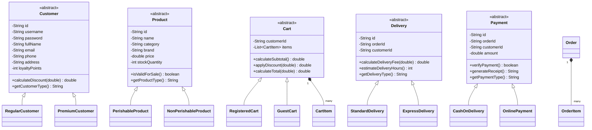

# Class Diagram (Mermaid)

```mermaid
classDiagram
    class Customer {
      <<abstract>>
      -String id
      -String username
      -String password
      -String fullName
      -String email
      -String phone
      -String address
      -int loyaltyPoints
      +calculateDiscount(double) double
      +getCustomerType() String
    }
    class RegularCustomer
    class PremiumCustomer
    Customer <|-- RegularCustomer
    Customer <|-- PremiumCustomer

    class Product {
      <<abstract>>
      -String id
      -String name
      -String category
      -String brand
      -double price
      -int stockQuantity
      +isValidForSale() boolean
      +getProductType() String
    }
    class PerishableProduct
    class NonPerishableProduct
    Product <|-- PerishableProduct
    Product <|-- NonPerishableProduct

    class Cart {
      <<abstract>>
      -String customerId
      -List~CartItem~ items
      +calculateSubtotal() double
      +applyDiscount(double) double
      +calculateTotal(double) double
    }
    class RegisteredCart
    class GuestCart
    Cart <|-- RegisteredCart
    Cart <|-- GuestCart

    class Delivery {
      <<abstract>>
      -String id
      -String orderId
      -String customerId
      +calculateDeliveryFee(double) double
      +estimateDeliveryHours() int
      +getDeliveryType() String
    }
    class StandardDelivery
    class ExpressDelivery
    Delivery <|-- StandardDelivery
    Delivery <|-- ExpressDelivery

    class Payment {
      <<abstract>>
      -String id
      -String orderId
      -String customerId
      -double amount
      +verifyPayment() boolean
      +generateReceipt() String
      +getPaymentType() String
    }
    class CashOnDelivery
    class OnlinePayment
    Payment <|-- CashOnDelivery
    Payment <|-- OnlinePayment

    class Order
    class OrderItem
    class CartItem
    Order "1" *-- "many" OrderItem
    Cart "1" *-- "many" CartItem
```
